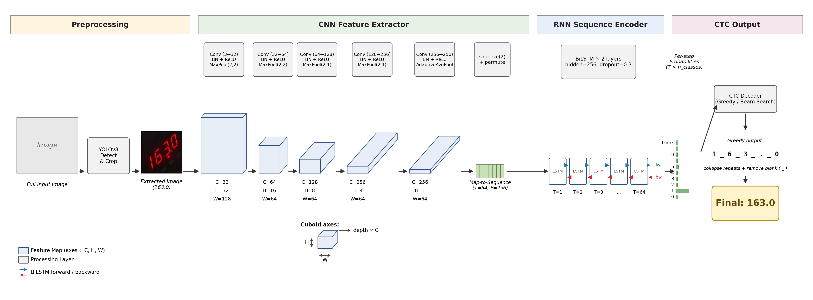

# LCD Number Recognition

A **seed project / methodology reference** for OCR on **seven-segment LCD displays**, built with **YOLOv8 + CRNN**. Trained from scratch on ~300 labeled images, the system reaches **100% validation accuracy** and **~96% real-world accuracy** on photos taken under varying lighting, angle, and distance.

> **What this repo is — and isn't.** This is a methodology reference, not a drop-in production tool. The ~300-image dataset is demo-scale: enough to validate the pipeline end-to-end and to deliver useful accuracy on a single device class, but not enough to claim general-purpose robustness. Real-world accuracy scales with the size and diversity of *your* dataset; the numbers below are a starting point for one device, not an upper bound. Treat the included weights as a baseline to bootstrap from, and the documented training loop as the actual deliverable.
>
> **About the data.** The training photos are production data from an internal industrial deployment and cannot be released for privacy reasons — a common constraint for OCR projects targeting real-world equipment. The code, training pipeline, and pretrained weights are open; users adapting this to their own LCDs will need to collect and label their own ~300 photos following the workflow below.

This repository is a complete, reproducible reference for a domain-specific OCR problem where generic OCR tools (EasyOCR, PaddleOCR, Tesseract) fail.

<p align="center">
  
  <br>
  <em>End-to-end pipeline. <a href="docs/crnn_pipeline.pdf">High-resolution PDF</a></em>
</p>

## Why this exists

Seven-segment LCD readouts (industrial scales, multimeters, instrument panels, etc.) are a common OCR target but a notoriously poor fit for general OCR engines:

- **Glyphs are not real fonts.** Seven-segment digits are spatial patterns of bright bars on dark backgrounds, with no anti-aliasing, no kerning, and no font priors that pretrained OCR models can leverage.
- **Spacing is irregular.** Industrial panels often align digits to fixed cells with wide gaps between them, breaking fixed-pitch character splitters.
- **Lighting is hostile.** Reflective glass, glare, oblique angles, and camera auto-exposure produce wildly different appearances of the same digit.

Generic OCR models trained on natural-scene text or scanned documents fall apart on this distribution. Training a small, domain-specific model from ~300 labeled photos beats every off-the-shelf engine I tested.

## Performance

| Stage | Model   | Training data         | Result                       |
|------:|---------|-----------------------|------------------------------|
|   1   | YOLOv8n | 314 labeled photos    | mAP50 = 0.995, Recall = 1.0  |
|   2   | CRNN    | 314 cropped LCDs      | Val 100%, Real-world ~96%    |

**On the ~4% real-world errors:** almost all failures are edge cases — extreme values rarely seen during training (e.g. sub-10 kg readings), severe backlighting, or unusual shooting angles. Critically, these failures are *predictable and detectable*: the misread value typically differs from the correct one by an order of magnitude, making them easy to catch during business review. Collecting these edge-case photos and adding them to the training set resolves each failure class permanently. This is precisely what the error-driven retraining loop is designed for.

**Real-world test set details (caveats up front).** The ~96% figure was measured on roughly **500 in-the-wild photos** of the same scale model, captured across **multiple operators, time periods (different days/lighting), and phone cameras**, all from the same factory deployment. Approximate error breakdown across observed failures:

| Failure mode                                  | Share of errors |
|-----------------------------------------------|----------------:|
| Digit confusion (e.g. `8`↔`0`, `1`↔`7`)       | ~50%            |
| Decimal-point dropped or hallucinated         | ~25%            |
| Whole-value misread (wrong magnitude / order) | ~15%            |
| YOLO localisation miss (no detection)         | ~10%            |

A few honest caveats:

- **Single-device evaluation.** All test photos come from one scale model. Cross-device numbers will be lower until you collect device-specific data.
- **No public benchmark.** The dataset is private production data and cannot be released, so these numbers are not externally verifiable. Reproduce them on your own LCD by following the training workflow below.
- **100% val on 300 images is a warning sign, not a flex.** With this dataset size, the validation split is small and overlaps the device/lighting distribution of the training split — read it as "the model has clearly learned the task on this distribution," not as "the model is perfect." Real-world accuracy on held-out photos is the number that matters.

## Engineering highlights

### Two-stage decomposition over end-to-end
The full task (photo → digits) is decomposed into **detect-then-read** because the two sub-tasks have very different data requirements. Detection needs spatial context and benefits enormously from ImageNet/COCO pretraining (so a fine-tuned YOLOv8n hits 0.995 mAP with 314 images). Recognition needs only clean, normalized crops and is data-cheap to train from scratch. End-to-end models would force both sub-tasks to share a backbone and would need 10× more data to converge.

### Minimal inference requirements
The full pipeline runs on CPU with no GPU and no network connection. On an Intel i5-10310U (a mid-range 2019 laptop processor), the system processes approximately **3 photos per second** end-to-end — fast enough for batch processing a month's worth of scale photos in under a minute. Total model footprint is ~22 MB (YOLOv8n 6 MB + CRNN 16 MB). Any machine capable of running Python can deploy this system.

### `smart_resize`: handling resolution drift
A subtle but high-impact issue: modern phone cameras produce LCD crops 1000+ pixels wide, while older training data has crops around 200–400 pixels. After the standard 64 × 256 resize, high-res crops compress digits into a different frequency distribution than the training set, causing silent accuracy degradation on new photos. `smart_resize` pre-downscales any crop wider than 400 px to ≤300 px **before** the standard transform, restoring distributional consistency. This single change moved real-world accuracy from ~88% to ~96%.

### CTC decoding over fixed-pitch segmentation
Character spacing varies across LCD models. Any fixed-width or fixed-count segmentation scheme breaks the moment a new device is introduced. CTC handles variable-length output without explicit segmentation and degrades gracefully on partially occluded or blurred digits.

### CRNN trained from scratch (no pretraining)
The CRNN backbone is small (~3M parameters) and trains from random initialization on 314 crops in ~15 minutes on a free Kaggle T4. Pretraining on synthetic seven-segment data was tried; it offered no improvement, because the real-world variation is in lighting and angle, not glyph shape — and those variations are already covered by the augmentation pipeline (brightness/contrast jitter, random rescale).

### Iterative error-driven retraining loop
The repository includes a workflow for closed-loop improvement:

```
visualize predictions on new photos  (visualize_yolo_results.py)
    ↓
identify misclassified samples
    ↓
extract originals by filename       (extract_error_samples.py)
    ↓
label, crop, append to training set
    ↓
retrain CRNN (~15 min)
```

This is how the system went from ~88% to ~96% real-world accuracy without growing the dataset beyond ~300 images: each retraining round targets the model's actual failure modes rather than adding random samples.

A fully automated version of this pipeline (error collection → auto-labeling → scheduled retraining) exists in the production deployment but is not included in this repository. The manual workflow documented here mirrors the same logic.

### Portability across LCD devices
The pipeline is not specific to the weighing scale used during development. Adapting it to any seven-segment display requires only:

1. **Re-label bounding boxes** (~30 minutes with labelImg) — the LCD panel appearance varies by device, but the annotation task is identical.
2. **Retrain CRNN** (~15 minutes on a free Kaggle T4) — the character set (0–9 + decimal point) is universal across all numeric displays.

The YOLOv8 detector *may* not need retraining across devices — this is a **conjecture based on the visual similarity of seven-segment LCD panels**, not a claim validated by cross-device experiments. The detector in this repository was trained on a single device class, and no formal generalisation study has been run. Treat re-using the existing detector as a worth-trying default; budget for re-labelling (~30 minutes) if detection fails on your hardware.

## What Didn't Work — Iteration Log

This project followed Andrew Ng's ML strategy: **set up a metric, build quickly, do error analysis, iterate**. Below is every approach tried before the final solution, in order. Each failure taught something the next attempt exploited.

---

### Attempt 1 — HSV color segmentation + EasyOCR ❌

**Idea:** LED digits are red. Threshold the photo in HSV space to isolate red pixels, find the largest connected component, crop it, pass to EasyOCR.

**What happened:**

Color segmentation worked fine on clean test images. In production it failed immediately:

- Cardboard bales, rusty metal, wooden pallets, and even shadow edges all fell inside the red-hue HSV range used to detect LEDs.
- The segmentation consistently selected the wrong region — the pallet or the background, not the display.
- More hand-crafted rules were layered on: aspect-ratio filters, area thresholds, row-projection peaks. Each rule fixed one photo and broke three others.
- Even when the crop was correct, EasyOCR mis-read 7-segment glyphs — confusing `1` with `7`, `0` with `D`, `5` with `S` — because it has no training signal for this font class.

**Root cause:** Two problems stacked. The localization strategy had no generalization; it was tuned to specific lighting conditions in a handful of test images. And the recognition model was fundamentally the wrong tool for the glyph class.

**Lesson:** Hand-crafted localization rules do not generalize. The correct response to "my rules keep breaking" is not more rules — it is a learned localization model.

---

### Attempt 2 — TrOCR fine-tuned on the bottom half of each photo ❌

**Idea:** Skip localization entirely. Fine-tune Microsoft TrOCR on the bottom 50% of each photo — the LCD is usually there — and let the transformer learn to attend to the relevant region.

**What happened:**

Training loss decreased. Validation accuracy stayed at 0% for the first 30 epochs, then briefly spiked to ~18%, then collapsed again.

The failure was diagnosed by a deliberate probe: feeding a fully black image through the fine-tuned model. It output `1012.0`. The model had learned the **marginal distribution of the training labels** — most values in the dataset are in the 1000–1100 range — and used that as a prior regardless of input. It never learned to read digits.

The underlying cause: the LCD panel occupied roughly 3–5% of the bottom-half image. The transformer's attention was diffused across a large, noisy field. With only ~300 training examples there was not enough signal to pull attention to the correct region.

**Lesson:** Model capacity does not substitute for input quality. The signal-to-noise ratio of the input determines the ceiling; no architecture change can fix that. Localization must happen before recognition.

---

### Attempt 3 — CRNN on the bottom half of each photo ❌

**Idea:** Same crop strategy as Attempt 2, but replace TrOCR with a lightweight CRNN. Hypothesis: a smaller, simpler model might overfit less to label statistics and actually read pixels.

**What happened:**

Same failure mode, different model. The CRNN converged to outputting values in the `10xx.x` range for every input. The black-image probe again returned `11.5`. The model learned dataset statistics, not digit features.

A second failure emerged when mixing high-resolution camera photos (LCD crops ~1000 px wide) with low-resolution phone photos (crops ~200 px wide): after the standard resize to 64 × 256, the two populations landed in very different frequency distributions. The model fit neither well.

**Lesson:** Confirmed — the localization problem must be solved first. Also identified the resolution-mismatch issue that would later require `smart_resize`.

---

### The fix — Manual annotation + YOLOv8 fine-tuning ✅

**Insight:** Stop trying to localize the LCD programmatically. Spend 30 minutes drawing 314 bounding boxes in labelImg. Train a model to localize.

- YOLOv8n fine-tuned on 314 labeled photos → mAP50 = 0.995, Recall = 1.0
- CRNN now receives tight, clean crops containing only digits
- With clean input, a CRNN trained from scratch on ~300 images achieves 100% validation accuracy and ~96% on held-out real-world photos

The 30-minute annotation session was the highest-leverage action in the entire project. Everything before it was trying to avoid that investment through cleverness.

---

### Bonus failure — ignoring resolution drift ⚠️

After the YOLO + CRNN pipeline was working, a new batch of photos from an older high-resolution camera dropped real-world accuracy from ~96% to ~70%. The crops looked fine visually. The bug was invisible.

Diagnosis: the old camera produced LCD crops 1000–1400 px wide. After the 64 × 256 resize, the digit strokes were compressed to a different pixel-level pattern than the ~300 px crops the model was trained on — same semantic content, different low-level statistics.

Fix: `smart_resize` — pre-downscale any crop wider than 400 px to ≤300 px before the standard transform.

```python
def smart_resize(img):
    w, h = img.size
    if w > 400:
        scale = 300 / w
        img = img.resize((int(w * scale), int(h * scale)), Image.LANCZOS)
    return img
```

One function, seven lines, +8 percentage points on real-world accuracy.

---

## Repository layout

```
.
├── main.py                      # CLI inference entry point
├── ocr_reader.py                # YOLO + CRNN inference pipeline
├── visualize_yolo_results.py    # Batch annotated-image visualization
├── requirements.txt
├── models/                      # (download weights into this directory)
│   ├── best.pt                  # YOLOv8 weights
│   ├── final_crnn.pth           # CRNN weights
│   └── crnn_config.json         # CRNN charset config
└── training/
    └── scripts/
        ├── label_lcd_values.py     # 1. Interactively label digit values
        ├── crop_lcd_regions.py     # 2. Crop LCD regions via bbox annotations
        ├── prepare_yolo_dataset.py # 3a. Build YOLO train/val split
        ├── train_yolo.py           # 3b. Train YOLOv8n
        ├── train_crnn.py           # 4. Train CRNN
        └── extract_error_samples.py# Helper: recover originals for re-labeling
```

> Trained weights, source photos, and labels are not included in this repository. See **Download weights** below.

## CRNN architecture

```
Input: (B, 3, 64, 256)
  ↓ Conv2d(3→32)   + BN + ReLU + MaxPool(2,2)  → (B,  32, 32, 128)
  ↓ Conv2d(32→64)  + BN + ReLU + MaxPool(2,2)  → (B,  64, 16,  64)
  ↓ Conv2d(64→128) + BN + ReLU + MaxPool(2,1)  → (B, 128,  8,  64)
  ↓ Conv2d(128→256)+ BN + ReLU + MaxPool(2,1)  → (B, 256,  4,  64)
  ↓ Conv2d(256→256)+ BN + ReLU + AvgPool(1,*)  → (B, 256,  1,  64)
  ↓ squeeze + permute                          → (B,  64, 256)
  ↓ BiLSTM(256→256, 2 layers)                  → (B,  64, 512)
  ↓ Linear(512→12)                             → (B,  64,  12)
  ↓ permute                                    → (64,  B,  12)
  ↓ CTC greedy decode
Output: digit string (charset 0123456789. + CTC blank = 12 classes)
```

## Quick start

```bash
pip install -r requirements.txt
```

Place trained weights in `models/`:
```
models/best.pt
models/final_crnn.pth
models/crnn_config.json
```

Run inference:
```bash
# Single image
python main.py path/to/photo.jpg

# Whole directory (recursive)
python main.py path/to/folder

# Multiple files
python main.py img1.jpg img2.jpg img3.jpg
```

Or use the pipeline programmatically:
```python
from ocr_reader import read_lcd_number, read_lcd_batch

# Single image — returns (value, confidence). value is None on failure.
value, conf = read_lcd_number("path/to/photo.jpg")
print(value, conf)  # e.g. 1027.5 0.987

# Override the value-range sanity check (defaults come from crnn_config.json)
value, conf = read_lcd_number("path/to/photo.jpg", min_val=0.0, max_val=99999.9)

# Batched inference (YOLO + CRNN both run in batches) — list of (value, conf).
results = read_lcd_batch(["a.jpg", "b.jpg", "c.jpg"])
```

`confidence` is the minimum per-character softmax probability from the CRNN
decode — low values flag samples worth routing to human review.

Visualize predictions over a folder:
```bash
python visualize_yolo_results.py --input path/to/photos --output path/to/output
```

## Training your own model

All training scripts accept paths via command-line flags.

**1. Label LCD bounding boxes** with [labelImg](https://github.com/HumanSignal/labelImg) — single class `lcd`, YOLO format.

**2. Label digit values** for each photo:
```bash
python training/scripts/label_lcd_values.py \
    --photos /path/to/photos \
    --labels /path/to/labels.csv
```

**3. Crop LCD regions** for CRNN training:
```bash
python training/scripts/crop_lcd_regions.py \
    --photos      /path/to/photos \
    --annotations /path/to/annotations \
    --dataset     /path/to/crops \
    --labels      /path/to/labels.csv
```

**4. Train YOLOv8**:
```bash
python training/scripts/prepare_yolo_dataset.py \
    --photos      /path/to/photos \
    --annotations /path/to/annotations \
    --output      /path/to/yolo_dataset

python training/scripts/train_yolo.py \
    --dataset /path/to/yolo_dataset \
    --output  /path/to/yolo_runs
```

**5. Train CRNN**:
```bash
python training/scripts/train_crnn.py \
    --data   /path/to/crops \
    --output /path/to/crnn_out
```

The CRNN output directory will contain `final_crnn.pth` and `crnn_config.json` ready to copy into `models/`.

## Download weights

Pretrained weights are published as **GitHub Releases** in this repository — see the **Releases** tab. Download `best.pt`, `final_crnn.pth`, and `crnn_config.json` and place them in `models/`.

## License

This project is licensed under **AGPL-3.0**. It depends on [ultralytics](https://github.com/ultralytics/ultralytics) (YOLOv8), which is itself AGPL-3.0 licensed; any derivative work must comply with the AGPL-3.0 terms.

Trained model weights distributed via Releases are released under **CC BY 4.0** — free to use, including commercially, with attribution.
