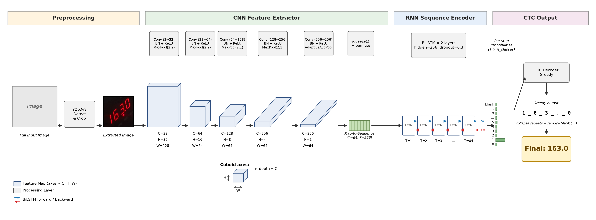

# LCD Number Recognition

Seven-segment LCD display OCR using **YOLOv8 (detection) + CRNN (recognition)**. Trained on **~1400 labeled photos**, reaching **[FILL IN]% validation accuracy** and **[FILL IN]% real-world accuracy** on unseen production photos.

> **Scope.** This is a methodology reference, not a drop-in production tool. Source photos are internal industrial data and cannot be released for privacy reasons. Code, training pipeline, and pretrained weights are open — adapting this to your own LCD device requires collecting and labeling your own photos following the workflow below.

<p align="center">
  
  <br>
  <em>End-to-end pipeline. <a href="docs/crnn_pipeline.pdf">High-resolution PDF</a></em>
</p>

## Why this exists

Seven-segment LCD readouts (industrial scales, multimeters, instrument panels) are a poor fit for general-purpose OCR engines — no font priors, irregular spacing, hostile real-world lighting. A small, domain-specific CRNN trained on a few hundred labeled photos outperforms every off-the-shelf engine tested.

## Performance

| Stage | Model   | Training data       | Result                          |
|------:|---------|----------------------|----------------------------------|
|   1   | YOLOv8n | ~1400 labeled photos | mAP50 = [FILL IN]                |
|   2   | CRNN    | ~1400 cropped LCDs   | Val [FILL IN]%, real-world [FILL IN]% |

Dataset grew from ~800 to ~1400 photos through continued production use and error-driven retraining, further improving coverage of lighting, angle, and distance conditions.

**Known limitation:** CTC decoding merges adjacent identical characters unless the model explicitly emits a separator between them. On values with repeated adjacent digits (e.g. `1006.5`), this can silently drop a digit (`1006.5` → `106.5`) — and this error is *not* reliably flagged by decode confidence. Beam search decoding and geometric consistency checks (expected digit count from bounding-box width) are the most promising mitigations, not yet implemented here.

## Quick start

```bash
pip install -r requirements.txt
```

Place trained weights in `models/`: `best.pt`, `final_crnn.pth`, `crnn_config.json` (see **Download weights** below).

```bash
python main.py path/to/photo.jpg      # single image
python main.py path/to/folder         # whole directory (recursive)
```

```python
from ocr_reader import read_lcd_number, read_lcd_batch

value, conf = read_lcd_number("path/to/photo.jpg")   # (value, confidence); None on failure
results = read_lcd_batch(["a.jpg", "b.jpg", "c.jpg"])
```

## Training your own model

1. **Label bounding boxes** with [labelImg](https://github.com/HumanSignal/labelImg) — single class `lcd`, YOLO format.
2. **Label digit values**: `python training/scripts/label_lcd_values.py --photos DIR --labels labels.csv`
3. **Crop LCD regions**: `python training/scripts/crop_lcd_regions.py --photos DIR --annotations DIR --dataset DIR --labels labels.csv`
4. **Train YOLOv8**: `python training/scripts/prepare_yolo_dataset.py ...` then `train_yolo.py`
5. **Train CRNN**: `python training/scripts/train_crnn.py --data DIR --output DIR`
   - Add `--val-files "a.jpg,b.jpg,..."` to manually pin a representative validation set instead of a random split — recommended once you have enough labeled data to hand-pick examples covering your real deployment conditions (lighting, angle, distance).

## Download weights

Pretrained weights are published as **GitHub Releases** — see the **Releases** tab. Download `best.pt`, `final_crnn.pth`, and `crnn_config.json` into `models/`.

## License

Licensed under **AGPL-3.0** (depends on [ultralytics](https://github.com/ultralytics/ultralytics) YOLOv8, itself AGPL-3.0). Trained model weights distributed via Releases are under **CC BY 4.0** — free to use, including commercially, with attribution.
